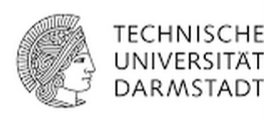
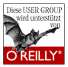
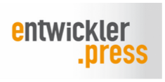
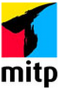
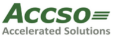
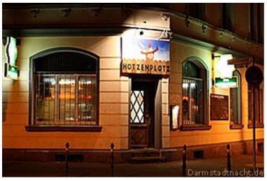

layout: true
.logo[]
.copyright[&copy; 2015 Java User Group Darmstadt]
---
class: center, middle

# Aktuelle Informationen
## JUG Darmstadt @
.slideshow[<input id="autoSlideshow" type="checkbox" title="Auto Slideshow" />]

---
background-color: #ff0000;

## Nächste Events

&nbsp;
### **16.07.2015**: Anatomy of Microservice Landscapes (Michael Plöd)
### **xx.08.2015**: noch offen
### **xx.09.2015**: noch offen
### **xx.10.2015**: MVC für JavaEE (Thilo Frotscher)
### **19.11.2015**: Neo4j und jQAssistent (Michael Hunger & Dirk Mahler)

---
background-image: url(img/plakat.png)

## Plakat

--
&nbsp;
.stripe[Download unter http://jug-da.de/termine]

--

&nbsp;
.stripe[Bitte Ausdrucken und Aufhängen]

---

## Unsere Kanäle

--

&nbsp;
### **Twitter**: [@JUG_DA](https://twitter.com/jug_da)

### **Blog** (Ankündigungen, Anmeldungen): http://jug-da.de

### **Mailingliste**: http://groups.google.com/forum/#!forum/jug-da

--

&nbsp;
#### **und noch mehr**: Xing-Gruppe, Google+: http://gplus.to/jugda, ...

---

## Wechselnde Veranstaltungsorte

Wir suchen interessierte Firmen, bei denen wir Vorträge veranstalten können.

- Raumanforderung: 30+
- Zeitraum: abends ab 18:30 Uhr
- Örtlichkeit: Darmstadt (Zentrumsnähe)
- Kontakt: jug-da-orga@googlegroups.com

---

## Code Retreat

- 04.07.2015, 9 - 17 Uhr
- Frankfurt, Die Zentrale, Berger Str. 175
- kostenlos
- Anmeldung: https://www.xing.com/events/code-retreat-workshop-frankfurt-1564912

---

## W-JAX

- 15 % Rabattcode: “jugda”

- https://jax.de/wjax2015

---

## Vielen Dank an unsere Sponsoren

---

## Verlosung

<label for="showAttendees">Zeige Teilnehmer <input id="showAttendees" type="checkbox" title="Zeige Teilnehmer" /></label>

<textarea id="attendees" style="display:none;" rows="10" cols="40" onClick="resizeLotteryInput(false);" onBlur="resizeLotteryInput(true);">
Gerd
Jan
Jörn
Marcel
Niko
Sebastian
Falk</textarea>

 <button onClick="nextWinner()">Nächster Gewinner</button>

---

## Viel Spaß beim Vortrag

&nbsp;
### Nach dem Vortrag ist vor dem Stammtisch

